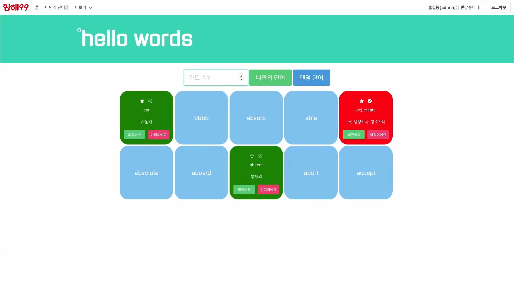

# 항해99 Chapter 1 - 팀별 미니 프로젝트(1조)

## 1. Preview

[](https://www.youtube.com/watch?v=aFoNL9F2swQ) 

## 2. Note

```config.ini
[DB_CONFIG]
HOST = ${Mongo DB URI}

[FLASK_SECRET_KEY]
KEY = ${Secret Key}
```

<ul>
    <li>
        <details>
            <summary>
                <b>Environment</b>
            </summary>
            <div class="highlight highlight-source-ini position-relative overflow-auto"><pre><span class="pl-en">[DB_CONFIG]</span>
<span class="pl-k">HOST</span> = ${Mongo DB URI}

<span class="pl-en">[FLASK_SECRET_KEY]</span>
<span class="pl-k">KEY</span> = ${Secret Key}</pre><div class="zeroclipboard-container position-absolute right-0 top-0">
    <clipboard-copy aria-label="Copy" class="ClipboardButton btn js-clipboard-copy m-2 p-0 tooltipped-no-delay" data-copy-feedback="Copied!" data-tooltip-direction="w" value="[DB_CONFIG]
HOST = ${Mongo DB URI}

[FLASK_SECRET_KEY]
KEY = ${Secret Key}" tabindex="0" role="button" style="display: inherit;">
      <svg aria-hidden="true" height="16" viewBox="0 0 16 16" version="1.1" width="16" data-view-component="true" class="octicon octicon-copy js-clipboard-copy-icon m-2">
    <path fill-rule="evenodd" d="M0 6.75C0 5.784.784 5 1.75 5h1.5a.75.75 0 010 1.5h-1.5a.25.25 0 00-.25.25v7.5c0 .138.112.25.25.25h7.5a.25.25 0 00.25-.25v-1.5a.75.75 0 011.5 0v1.5A1.75 1.75 0 019.25 16h-7.5A1.75 1.75 0 010 14.25v-7.5z"></path><path fill-rule="evenodd" d="M5 1.75C5 .784 5.784 0 6.75 0h7.5C15.216 0 16 .784 16 1.75v7.5A1.75 1.75 0 0114.25 11h-7.5A1.75 1.75 0 015 9.25v-7.5zm1.75-.25a.25.25 0 00-.25.25v7.5c0 .138.112.25.25.25h7.5a.25.25 0 00.25-.25v-7.5a.25.25 0 00-.25-.25h-7.5z"></path>
</svg>
      <svg aria-hidden="true" height="16" viewBox="0 0 16 16" version="1.1" width="16" data-view-component="true" class="octicon octicon-check js-clipboard-check-icon color-fg-success d-none m-2">
    <path fill-rule="evenodd" d="M13.78 4.22a.75.75 0 010 1.06l-7.25 7.25a.75.75 0 01-1.06 0L2.22 9.28a.75.75 0 011.06-1.06L6 10.94l6.72-6.72a.75.75 0 011.06 0z"></path>
</svg>
    </clipboard-copy>
  </div>
            </div>
        </details>
    </li>
  <li>
    <details>
      <summary>
        <b>Dependencies</b>
      </summary>
      <div markdown="1">
        <ul>
          <li>flask</li>
          <li>pymongo</li>
          <li>PyJWT</li>
          <li>configparser</li>
          <li>certifi</li>
        </ul>
      </div>
    </details>
  </li>
  <li>
    <details>
      <summary>
        <b>Refrence</b>
      </summary>
      <div markdown="1">
        <ul>
          <a href="https://choewy.tistory.com/125"
            ><li>S.A(Start Assignment)</li></a>
        </ul>
      </div>
    </details>
  </li>
</ul>
## 3. Role

<ul>
  <li>
    <details>
      <summary>
        <b>최원영</b>
      </summary>
      <div markdown="1">
        <ul>
          <li>단어 조회 페이지 구현</li>
          <li>전체 기능 검토 및 통합</li>
          <li>Repo 관리, 리팩토링</li>
        </ul>
      </div>
    </details>
  </li>
  <li>
    <details>
        <summary>
          <b>하상우</b>
        </summary>
        <div markdown="1">
          <ul>
            <li>회원가입, 로그인 페이지 구현</li>
            <li>회원 인증 API 구현</li>
          </ul>
        </div>
      </li>
	<li>
	<details>
    <summary>
      <b>홍승민</b>
    </summary>
    <div markdown="1">
      <ul>
        <li>단어 퀴즈 페이지 구현</li>
        <li>단어 수정 및 삭제 API 구현</li>
        <li>서버 배포 및 관리</li>
      </ul>
    </div>
  </details>
  <li>
    <details>
      <summary>
        <b>김형중</b>
      </summary>
      <div markdown="1">
        <ul>
          <li>단어 조회 API 구현</li>
          <li>단어 등록 API 구현</li>
          <li>커스텀 Alert 구현</li>
        </ul>
      </div>
    </details>
  </li>
</ul>

## 4. Log

<ul>
    <li>
  <details>
    <summary>
      <b>1일차 : 03.07(월)</b>
    </summary>
    <div markdown="1">
      <ul>
        <li>주제 선정 및 기능 정의</li>
        <li>템플릿 구성, DB 스키마 및 API 설계</li>
        <li>테스트 버전 구현 (템플릿 : 김형중, 하상우 / API : 최원영, 홍승민)</li>
        <li>점검 및 코드 리뷰 진행</li>
      </ul>
    </div>
  </details>
</li>
<li>
  <details>
      <summary>
        <b>2일차 : 03.08(화)</b>
      </summary>
      <div markdown="1">
        <ul>
          <li>세부 내용 설계 및 로직 확정</li>
          <li>역할 분담</li>
          <li>JWT 사용자 인증, 인가 기능 구현</li>
          <li>전체 템플릿 구현 완료</li>
        </ul>
      </div>
    </li>
  <li>
  <details>
  <summary>
    <b>3일차 : 03.09(수)</b>
  </summary>
  <div markdown="1">
    <ul>
      <li>중간 점검 및 코드 리뷰 진행</li>
      <li>전체 기능 구현 완료</li>
      <li>코드 병합</li>
    </ul>
  </div>
</details>
<li>
  <details>
    <summary>
      <b>4일차 : 03.10(목)</b>
    </summary>
    <div markdown="1">
      <ul>
        <li>MVC 패턴으로 구조 변경</li>
        <li>유저의 이름(아이디) 표시</li>
        <li>커스텀 Alert 적용</li>
        <li>최종 검토</li>
        <li>시연 영상 촬영 및 편집</li>
        <li>이슈 사항 정리 및 회고</li>
      </ul>
    </div>
  </details>
</li>
</ul>
